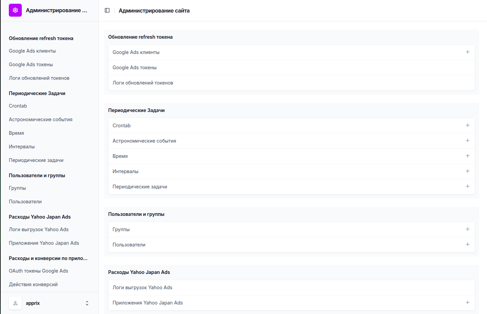
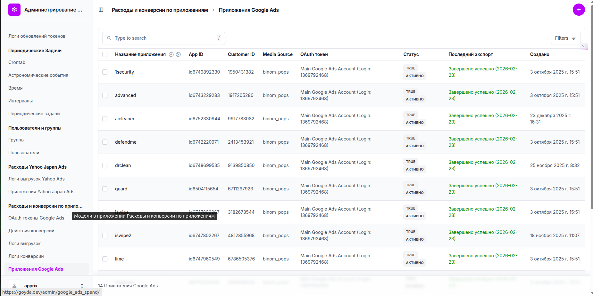
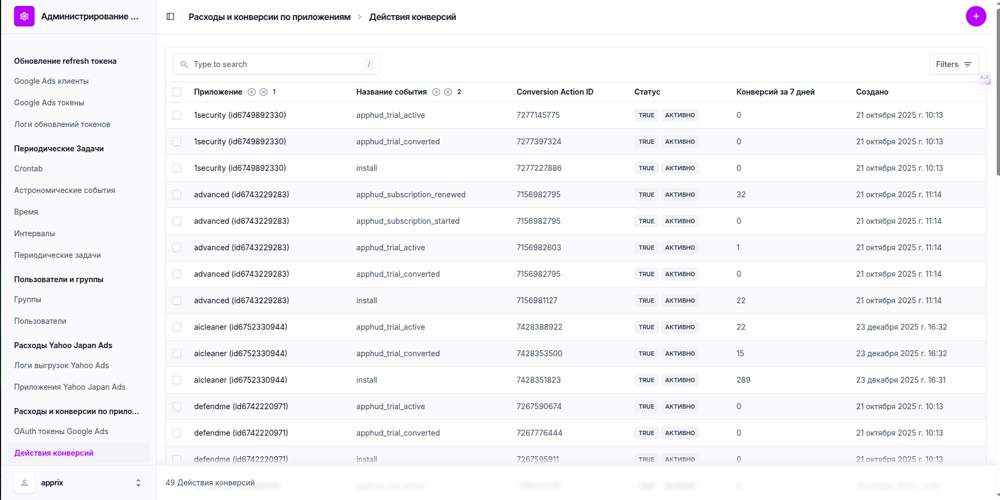
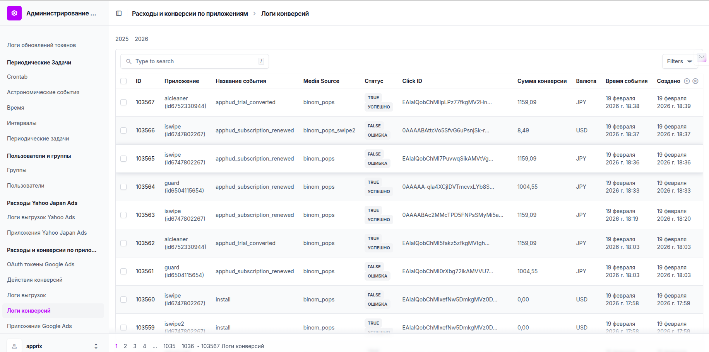

# Руководство пользователя — Админка Google Ads

[https://goyda.dev/admin/](https://goyda.dev/admin/)

Логин, пароль домена выдаётся по запросу

Админка для отправки расходов и конверсий Google Ads, здесь:

- настраивается аккаунт гугла, приложения и конверсии, 
- через планировщик (Celery) автоматически каждые сутки отправляются расходы
- по вебхуку обрабатываются конверсии и отправляются в AppsFlyer

Главная страница:

### **Самые основные разделы:**

1. Приложения Google Ads

[https://goyda.dev/admin/google_ads_spend/googleadsapplication/](https://goyda.dev/admin/google_ads_spend/googleadsapplication/)

Здесь можно отредактировать существующие приложения (поменять креды, сурс и т.п.)
и добавить новое приложение (оно автоматически будет включено в отправку расходов и конверсий)

2. Действия конверсий

[https://goyda.dev/admin/google_ads_spend/conversionaction/](https://goyda.dev/admin/google_ads_spend/conversionaction/)

Здесь добавляются конверсии из гугла под каждое приложение, или редактируются существующие

Логи конверсий

[https://goyda.dev/admin/google_ads_spend/conversionlog/](https://goyda.dev/admin/google_ads_spend/conversionlog/)

Просмотр логов конверсий, можно отфильтровать по каждому приложению

