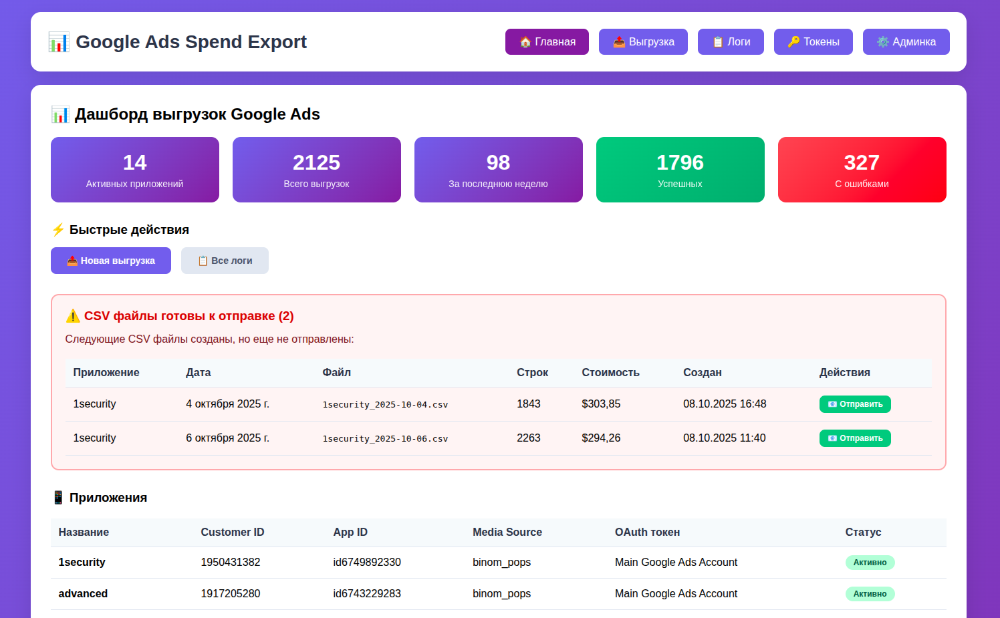
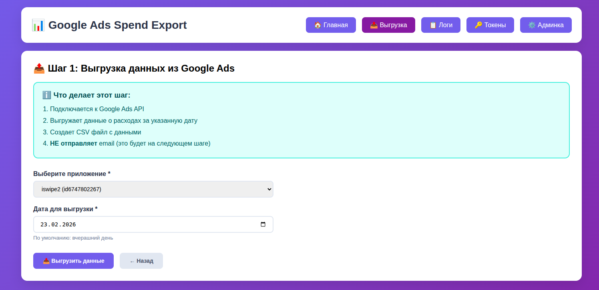
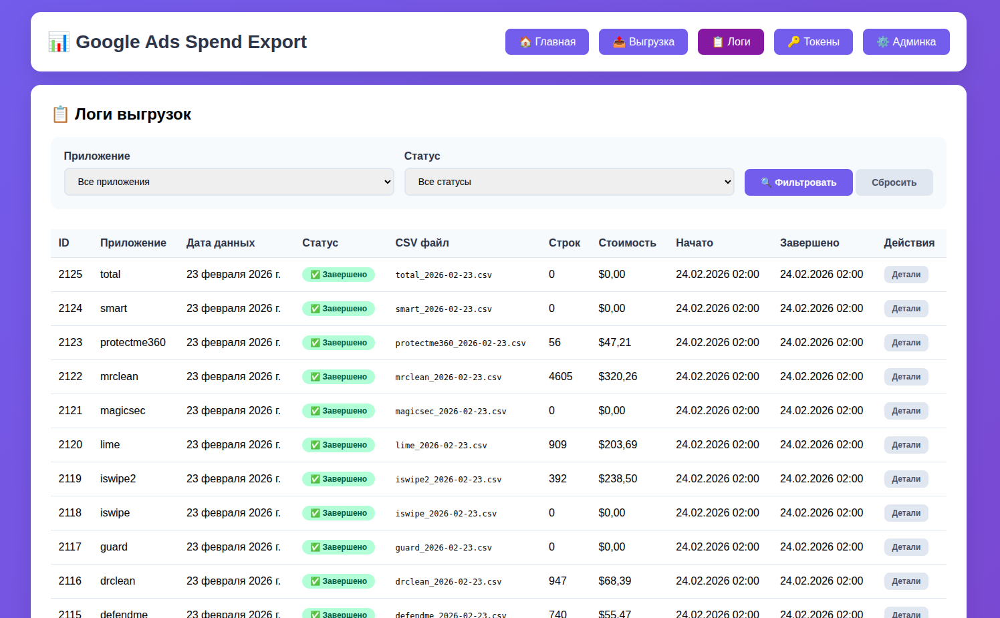

Расходы Google Ads

Страница управления расходами (косты) Google Ads

Главная:

https://goyda.dev/google-ads/

### **Самые основные разделы:**

1. Выгрузка

https://goyda.dev/google-ads/export/

Здесь можно сделать выгрузку расходов вручную (необходимо при повторной отправки если возникли какие-то ошибки в автоматической выгрузке или были обновления в приложении)

Нужно выбрать приложение, дату, нажать Выгрузить данные, после чего Отправить в AppsFlyer

2. Логи

https://goyda.dev/google-ads/logs/

Просмотр логов расходов

