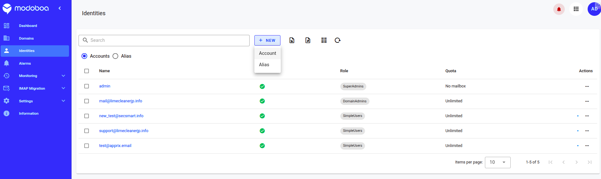
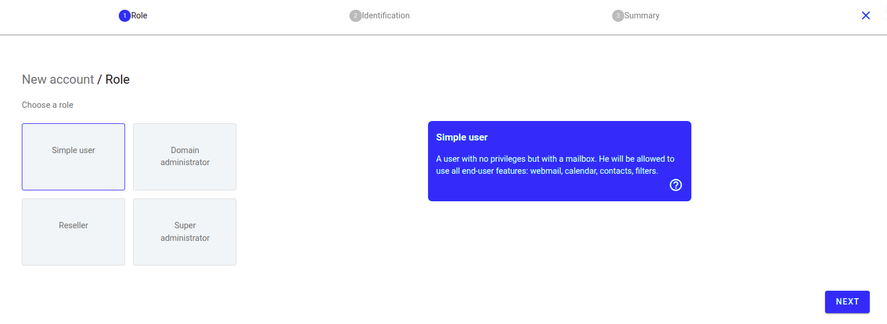
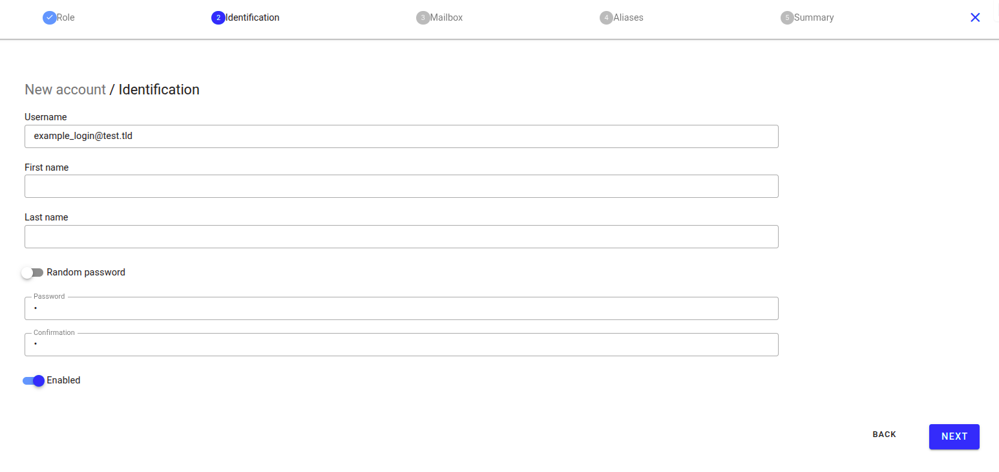
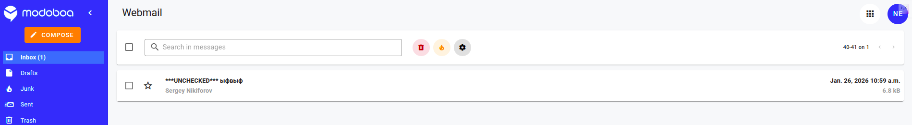

## 1. Создание почтового ящика

[https://mail.apprix.email/admin/identities](https://mail.apprix.email/admin/identities)

Нажимаем New -> Account -> Simple user -> Next

Задаём имя почтового ящика (логин) и пароль

Mailbox и Aliases пропускаем

## 2. Вход в почту

Сначала выходим из аккаунта админа и авторизовываемся под данными нового ящика

[https://mail.apprix.email/user/webmail](https://mail.apprix.email/user/webmail)

Можно пользоваться почтой! :)

