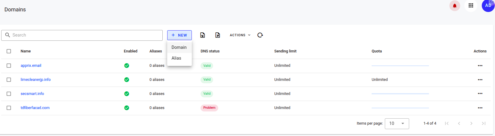
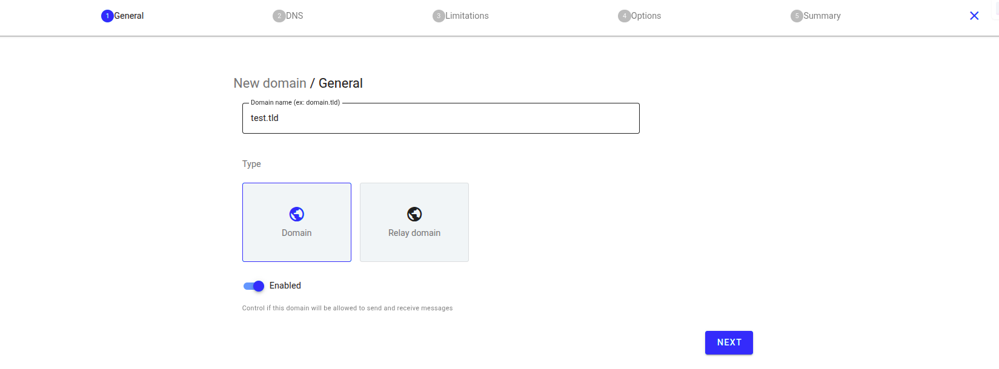
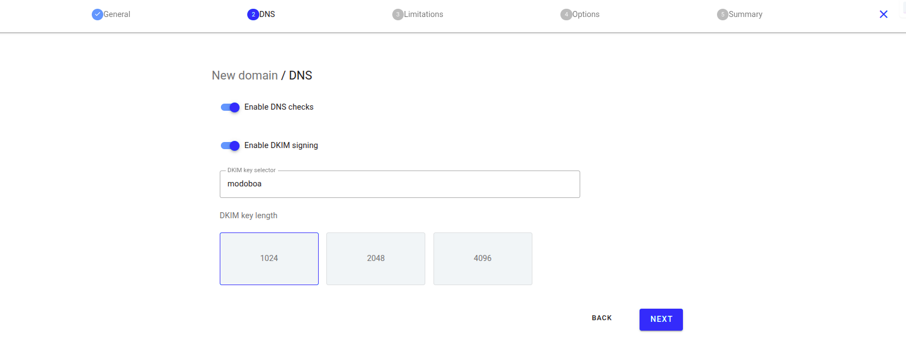
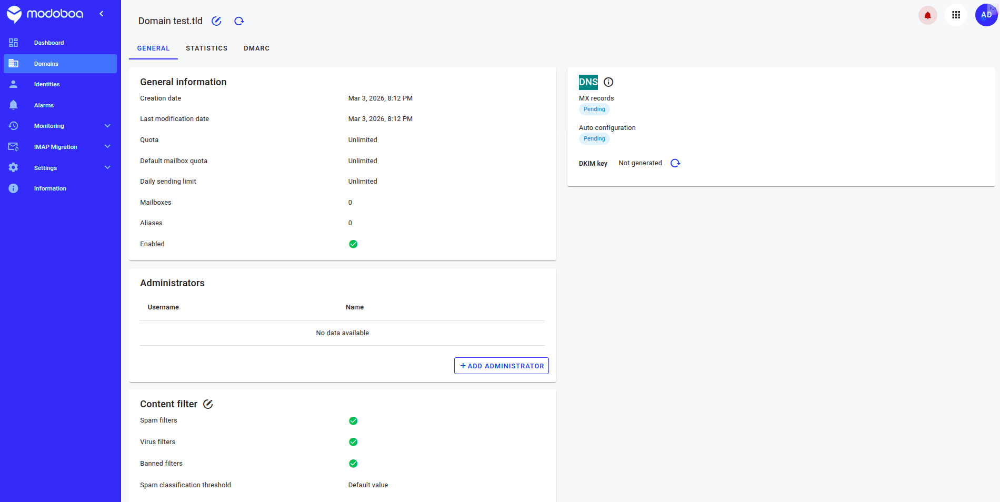
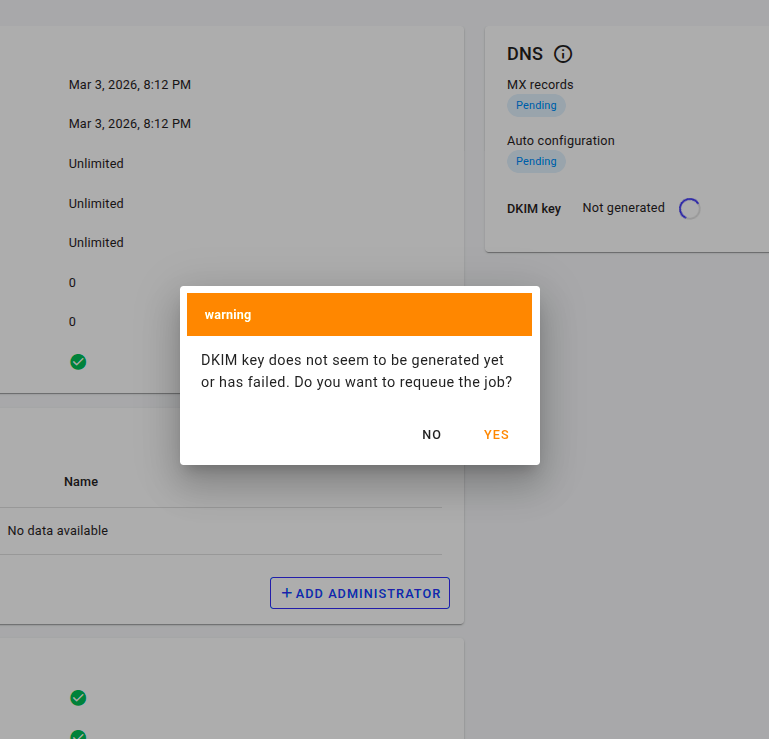
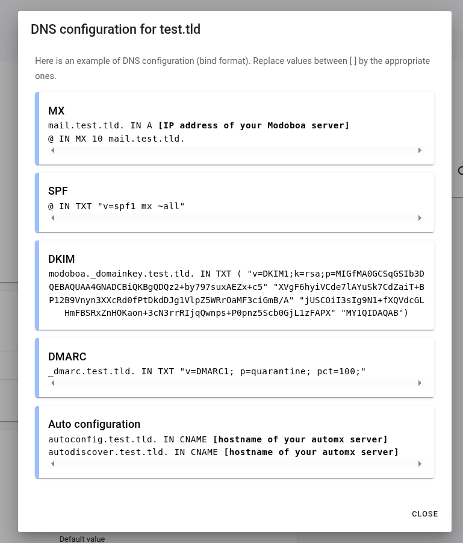

## 1. Добавление домена в админке

[https://mail.apprix.email/admin/domains](https://mail.apprix.email/admin/domains)

**Нажимаем New, выбираем Domain**

**Включаем опцию Enable DKIM signing**
**Значение DKIM key length можно выбрать 1024**
**Next**

**Шаги Limitations и Options можно не заполнять**

## 2. Значения для DNS записей

**!! Генерируем DKIM key**

**Копируем указанные записи из окна с информацией**

**В итоге в CloudFlare (или другом провайдере) должны быть такие записи:**

| Type | Name | Value | Priority |
|------|------|-------|----------|
| MX | @ | mail.apprix.email | 10 |
| TXT | @ | v=spf1 mx ~all | — |
| TXT | modoboa._domainkey.test.tld. | v=DKIM1; k=rsa; p=MIGfMA0GCSqGSIb3DQEBAQUAA4GNADCBiQKBgQDQz2+by797suxAEZx+c5XVgF6hyiVCde7lAYuSk7CdZaiT+BP12B9Vnyn3XXcRd0fPtDkdDJg1VlpZ5WRrOaMF3ciGmB/AjUSCOiI3sIg9N1+fXQVdcGLHmFBSRxZnHOKaon+3cN3rrRIjqQwnps+P0pnz5Scb0GjL1zFAPXMY1QIDAQAB | — |
| TXT | _dmarc | v=DMARC1; p=quarantine; pct=100; | — |
| CNAME | autoconfig | mail.apprix.email | — |
| CNAME | autodiscover | mail.apprix.email | — |

**!! После заполнения всех записей нужно дождаться статуса Valid у домена**